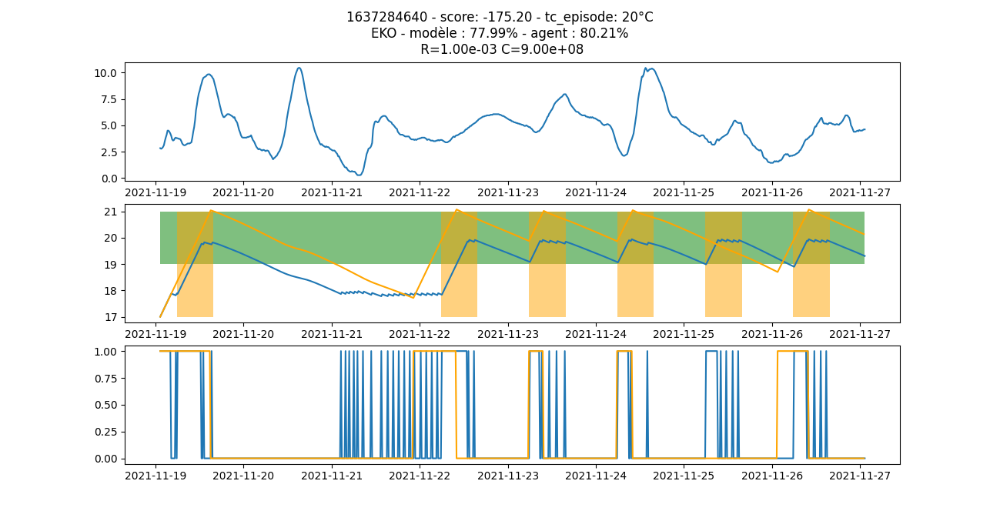
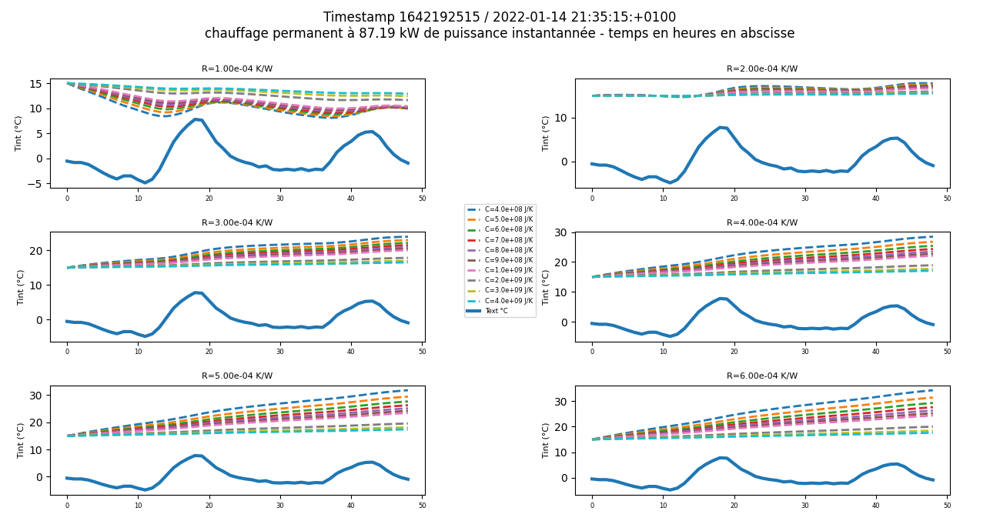

# Energy Gym
Environnement gym [openAI](https://github.com/openai/gym) pour simuler le comportement énergétique d'un bâtiment tertiaire

[](https://github.com/Open-Building-Management/EnergyGym/actions/workflows/ci.yml)

[](http://obm.dromotherm.com/EnergyGym/)

[le_jeu_du_chauffage_en_mode_random.webm](https://user-images.githubusercontent.com/24553739/190570843-7f1c81fc-90a3-436d-9e51-2086e0282a43.webm)


## requirements

```
sudo apt-get install -y python3-numpy python3-matplotlib
pip3 install click
pip3 install gym
pip3 install PyFina
pip3 install --upgrade tensorflow
```

play et basicplay utilisent l'autocomplétion en ligne de commande pour choisir le nom de l'agent

**play n'utilise pas l'environnement gym pour l'instant**

## standalone_d_dqn

Met en oeuvre un algorithme de type double DQN

Les réseaux après entrainement sont enregistrés dans un répertoire `TensorBoard/DDQN`

Les noms des réseaux entrainés commenceront par `Heat_SCENARIOXXXX_DDMMAAAA` avec SCENARIO valant `Hyst` ou `Vacancy`

pour lancer tensorboard :

```
tensorboard --logdir=TensorBoard
```

### scénario de type hystérésis

Ce scénario permet d'entrainer un réseau à maintenir une température constante autour d'une consigne donnée tc. C'est le réseau le plus simple, avec une espace d'observation de taille 3 : [Text, Tint, tc]

```
python3 standalone_d_dqn.py
```
Pour entraîner pour des consignes variables de 18, 19, 20, 21 et 22°C :
```
numéro du flux temp. extérieure : 1 
modèle : cells
scénario : Hyst
consigne moyenne de confort en °C : 20
demi-étendue en °C pour travailler à consigne variable : 2
```
Peu importe le modèle choisi pour l'entrainement, içi `cells`, le réseau obtenu fonctionnera aussi avec les autres modèles.

### scénario de type vacancy, pour entrainer à jouer une période de non-occupation

L'objectif est d'utiliser le moins d'énergie possible et d'avoir la température souhaitée à l'ouverture des locaux.

pour entrainer à modèle variable avec une histoire passée de 48 heures
```
python3 standalone_d_dqn.py --nbh=48
```
On peut définir des coefficients de pondération personnalisés pour la récompense :

```
python3 standalone_d_dqn.py --nbh=48 --k=1 --p_c=15 --vote_interval -1 1
```

Lorsqu'on joue un scénario de type vacancy, la récompense est la somme de 2 termes :
- l'un positif représentant l'énergie totale économisée
- l'autre négatif représentant le vote à l'ouverture du bâtiment

Il s'agit d'une récompense finale, attribuée à la fin de l'épisode

k est le coefficient énergétique

p_c est la pondération à appliquer sur le confort à l'ouverture des locaux, c'est-à-dire sur la valeur absolue de l'écart entre la température à l'ouverture des locaux et la température de consigne

vote_interval représente l'intervalle dans lequel la récompense énergétique est attribuée. si vote_interval vaut (-1, 1), on attribue le bonus énergétique si et seulement si l'écart entre la température à l'ouverture des locaux et la température de consigne est compris entre -1 et 1

## basicplay

La variable globale `TEXT_FEED` de [conf.py](conf.py#L30), dont la valeur par défaut est 1, définit le numéro du flux de température extérieure. Si on utilise les données du répertoire datas, on n'a pas besoin de changer ce paramètre.

Pour un espace d'observation sans historique ni prévisions :
```
python3 basicplay.py
```
On peut faire jouer des réduits d'inoccupation à un agent hystérésis que l'on a entrainé à consigne variable :
```
comportement de l'agent : deterministic
timestamp de démarrage aléatoire : True
scénario ou mode de jeu : Reduce
longueur des épisodes : week
modèle : tertiaire
jouer l'épisode pas à pas : False 
jouer le mirror play après avoir joué l'épisode : False 
consigne moyenne de confort en °C : 20 
demi-étendue en °C pour travailler à consigne variable : 2
nom du réseau : TensorBoard/DDQN/Heat_Hyst5400_200220232222_cells_GAMMA=0dot97_NBACTIONS=2_tc=20+ou-2
```


Par défaut la hauteur du réduit est de 2°C, c'est-à-dire que la nuit ou le week-end, on n'acceptera pas de descendre en dessous de 18°C si la température de consigne est 20°C. 
On peut moduler la hauteur du réduit en modifiant la valeur de la variable globale `REDUCE` dans [conf.py](conf.py#L31)

Pour un espace d'observation avec un historique de 48 heures :
```
python3 basicplay.py --nbh=48
```

paramètre |  description
--|--
agent_type | random = décision aléatoire<br>deterministic = argmax<br>stochastic = softmax
random_ts | True = joue jusqu'à 200 épisodes<br>False = joue un seul épisode sur le timestamp 1609104740
scenario | type d'environnement, par exemple<br>hyst: hysteresis<br>vacancy: non-occupation<br>reduce: hysteresis avec réduit hors occupation
size | week: 8 jours<br>weekend: 63 heures
modelkey | le nom d'une des configurations de [conf.py](conf.py) - random pour jouer un modèle au hasard
stepbystep | True = joue en mode pas à pas
tc | valeur de la consigne en °C
halfrange | demi-étendue en °C pour rendre la consigne variable
nbh | nombre d'heures que l'on peut remonter dans l'histoire passée
nbh_forecast | nombre d'heures de prévisions météo à donner à l'agent
action_space | taille de l'espace d'actions

## play

Attention : espace d'observation contenant seulement la situation courante

possibilité :
* de faire jouer simultanément l'agent et la politique optimale de l'environnement,
* de produire des statistiques

```
./play.py
```
paramètre |  description
--|--
text | numéro du flux de température extérieure = 1
model | le nom d'une des configurations de [conf.py](conf.py)
powerlimit | coefficient multiplicatif de la puissance max.
tc | température de consigne
n | **nombre d'épisodes à jouer**<br>0 = joue une série d'épisodes prédéfinis, on parle de snapshots
optimalpolicy | **politique optimale que l'environnement déterministe va jouer**<br>intermittence = succession de périodes d'occupation et de non-occupation<br>occupation_permanente = bâtiment occupé en permanence - cf hopital
hystpath | nom d'un agent de type hystérésis, à fournir si on veut utiliser un agent pour gérer les périodes de non-occupation et un hystéréris pour gérer les périodes de présence du personnel : `./play.py --hystpath=agents/hys20.h5`
holiday | nombre de jours fériés à intégrer dans les replay
silent | True = production de statistiques ou de snapshots<br>False = affiche les épisodes à l'écran
k | coefficient énergétique, utilisé dans le calcul de la récompense

<details id=1>
  <summary><h2>A propos du modèle d'environnement</h2></summary>

  L'environnement est représenté sous la forme d'un modèle électrique équivalent simple à deux paramètres :
  * une résistance R en K/W qui représente l'isolation du bâtiment
  * une capacité C en J/K qui représente l'inertie du bâtiment

  [Pour en savoir plus](https://github.com/Open-Building-Management/RCmodel/blob/main/RCmodel.ipynb)

  Pour une résistance de 1e-4 K/W, et quelle que soit l’inertie entre 4e8 et 4e9 J/K, le système de chauffage, même utilisé à fond en permanence, ne
  parvient pas à maintenir la température.

  Pour pouvoir gérer des épisodes de froid sur des bâtiments présentant majoritairement des résistances inférieures à 2e-4 K/W, la seule solution est
  d’augmenter la puissance disponible.

  On ne devrait toutefois pas rencontrer ce cas de figure sur le terrain si les équipements de production et les pompes sont correctement dimensionnés.

  Le couple R=2e-4 K/W et C=2e8 J/K semble donc être une configuration extrême, peu probable en pratique, mais susceptible de nous donner de la matière
  pour bien cerner le fonctionnement de notre modèle.

  ### comportement sous météo hivernale froide
  

</details>
