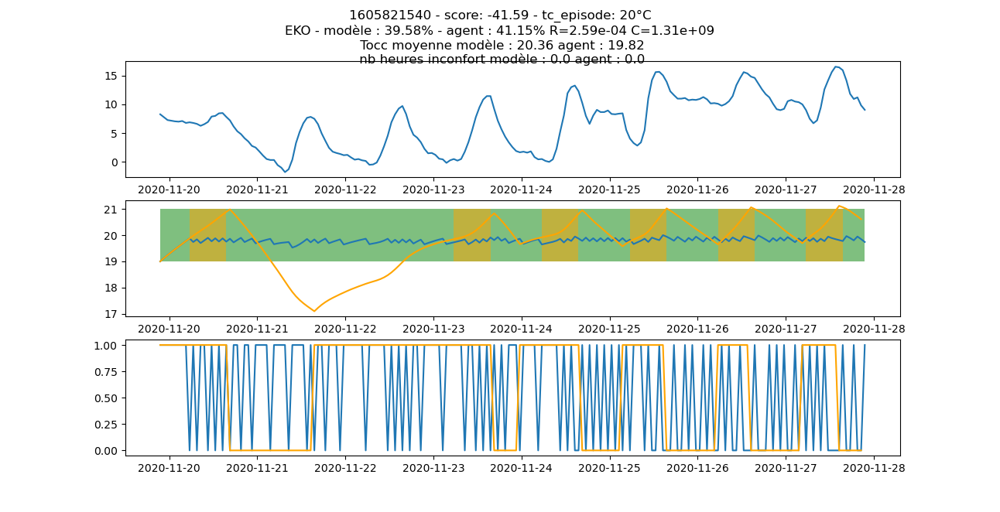
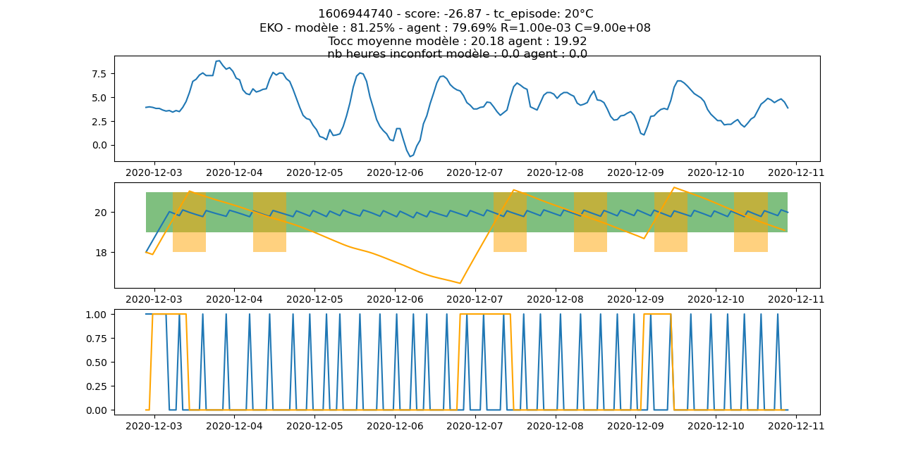
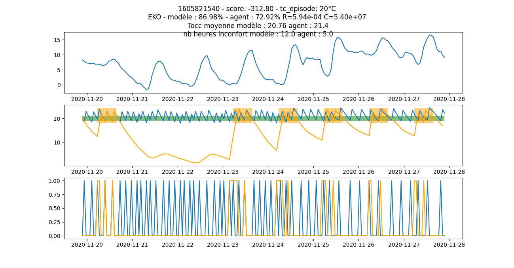
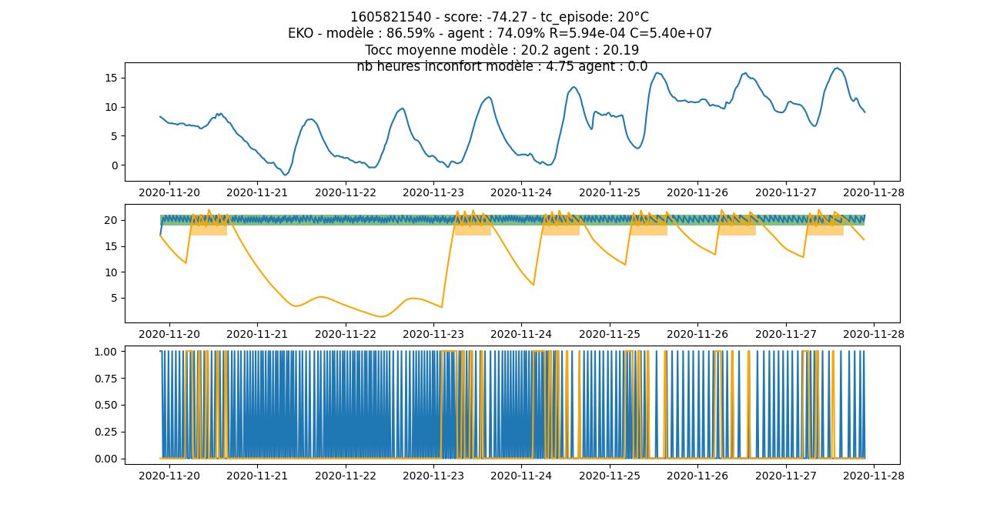

it is difficult to train a model which adapts to various building types. In RL everything relies on a the (not easy) design of a reward which here (tries to) balance confort and energy savings. But confort and energy savings have very different metrics !!

The lack of real world classified datas led to use synthetic datas generated by a simple RC model and to practise off policy training like deep Q network. Results are not so bad on buildings with little isolation and some inertia. When trying to train a single agent on random types of buildings, it is hard to qualify the performance. In those trainings, we suppose the heating system to be able to maintain 20°C inside when it is constant 0°C outside (so maximum power is supposed to be 1.1*20/R W).

Environnement gym [openAI](https://github.com/openai/gym)

Clone the folder, open with vscode and press CTRL-P in order to rebuild in container

[le_jeu_du_chauffage_en_mode_random.webm](https://user-images.githubusercontent.com/24553739/190570843-7f1c81fc-90a3-436d-9e51-2086e0282a43.webm)


Tous les exemples utilisent l'autocomplétion en ligne de commande pour choisir le nom de l'agent

<details><summary><h2>apprentissage renforcé</h2></summary>

Les réseaux après entrainement sont enregistrés dans le répertoire `TensorBoard`

pour lancer tensorboard :

```
tensorboard --logdir=TensorBoard
```
Pour obtenir de l'aide sur un algorithme :
```
python3 dueling.py --help
```

### scénario de type hystérésis

Ce scénario permet d'entrainer un réseau à maintenir une température constante autour d'une consigne donnée tc.
C'est le réseau le plus simple, avec une espace d'observation de taille 3 : [Text, Tint, tc]

```
python3 standalone_d_dqn.py
```
Pour entraîner un agent à gérer des consignes variables de 18, 19, 20, 21 et 22°C :
```
numéro du flux temp. extérieure : 1
modèle : cells
scénario : Hyst
consigne moyenne de confort en °C : 20
demi-étendue en °C pour travailler à consigne variable : 2
```
Peu importe le modèle choisi pour l'entrainement, içi `cells`, le réseau obtenu fonctionnera aussi avec toutes les configurations.

### scénario de type vacancy, pour entrainer à jouer une période de non-occupation

L'objectif est d'utiliser le moins d'énergie possible et d'avoir la température souhaitée à l'ouverture des locaux.

pour entrainer à modèle variable
```
python3 standalone_d_dqn.py --autosize_max_power=True
numéro du flux temp. extérieure ? [1]: 
modèle ou banque : synth
scénario : StepRewardVacancy
consigne moyenne de confort en °C : 20
demi-étendue en °C pour W à consigne variable : 2
nombre d'épisodes : 3000
```
On peut définir des coefficients de pondération personnalisés pour la récompense :

```
python3 standalone_d_dqn.py --autosize_max_power=True --k=1 --p_c=15 --vote_interval -1 1
```

Lorsqu'on joue un scénario de type vacancy, la récompense **finale**, attribuée à la fin de l'épisode, lorsque l'occupation du bâtiment recommence, est la somme de 2 termes :
- l'un positif proportionnel au pourcentage d'énergie totale économisée sur l'épisode
- l'autre négatif représentant en quelque sorte le vote à l'ouverture du bâtiment, de type hystérésis, donc proportionnel à la valeur absolue de l'écart entre la température à l'ouverture des locaux et la température de consigne

Lors des entrainements, le réseau va d'abord chercher à converger vers cette température cible pour ne pas avoir de malus, puis à maximiser l'énergie économisée.

coefficient | signification
--|--
p_c | pondération à appliquer sur le confort à l'ouverture
k | coefficient énergétique sur la partie finale de la récompense
k_step | coefficient sur la partie pas à pas de la récompense
vote_interval | intervalle de température dans lequel le bonus énergétique est attribué. si vote_interval vaut (-1, 1), on attribue le bonus énergétique si et seulement si l'écart entre la température à l'ouverture des locaux et la température de consigne est compris entre -1 et 1

</details>

<details><summary><h2>basicplay</h2></summary>

La variable globale `TEXT_FEED` de [conf.py](conf.py#L30), dont la valeur par défaut est 1, définit le numéro du flux de température extérieure. Si on utilise les données du répertoire datas, on n'a pas besoin de changer ce paramètre.

paramètre |  description
--|--
agent_type | random = décision aléatoire<br>deterministic = argmax<br>stochastic = softmax
random_ts | True = joue jusqu'à 200 épisodes<br>False = joue un seul épisode sur le timestamp 1609104740
scenario | type d'environnement, par exemple<br>hyst: hysteresis<br>vacancy: non-occupation<br>reduce: hysteresis avec réduit hors occupation
size | week: 8 jours<br>weekend: 63 heures
modelkey | le nom d'une des configurations de [conf.py](conf.py) - random pour jouer un modèle au hasard
stepbystep | True = joue en mode pas à pas
tc | valeur de la consigne en °C
halfrange | demi-étendue en °C pour rendre la consigne variable
nbh | nombre d'heures que l'on peut remonter dans l'histoire passée
nbh_forecast | nombre d'heures de prévisions météo à donner à l'agent
action_space | taille de l'espace d'actions

Pour un espace d'observation sans historique ni prévisions :
```
python3 basicplay.py
```
Pour un espace d'observation avec un historique de 48 heures :
```
python3 basicplay.py --nbh=48
```
</details>

## jouer un hystérésis

Avec la crise climatique, les gestionnaires de bâtiments sont tentés de vouloir couper au maximum le chauffage lorsque le bâtiment n'est pas occupé.

Hors il est assez compliqué de déterminer le moment opportun pour rallumer si on veut avoir la température de confort à l'ouverture des locaux. De plus, dans le milieu des chauffagistes, on entend dire qu'on ne fait pas plus d'économie en coupant car le coût pour remonter en température est souvent équivalent à celui qu'on doit payer pour maintenir une température stable.
Quant on n'a pas de capteurs de confort intérieur, pour maintenir cet hystérésis, on régule avec une loi d'eau sur la température extérieure :
```
water_temp = pente * (t_c - text) + t_c
```
`t_c` est la consigne de température intérieure, `text` la valeur de la température extérieure à l'instant t et `pente` la pente de la loi d'eau, souvent égale à 1.5.
La formule donne la valeur de la température de l'eau à injecter dans les tuyaux. Cette recette empirique fonctionne assez bien en pratique et c'est la méthode de régulation la plus répandue depuis plusieurs dizaines d'années.

Pour en revenir à l'intérêt des coupures sur des périodes courtes, il est vrai qu'en simulateur, l'agent hystérésis n'est généralement pas plus énergivore que la politique optimale qui effectue des coupures la nuit et les week-ends. Le premier graphique concerne des modulaires mal isolés, avec un système de chauffage sous-dimensionné, le second un ensemble de bureaux tertiaires avec une isolation correcte. 





C'est moins vrai lorsque le bâtiment est énergivore mais dispose d'un système de chauffage puissant (cas d'un bâtiment logistique de type hangar ou laboratoire dans lequel on a construit des petits bureaux, qui sont quasiment les seuls espaces chauffés)



Avec un pilotage au quart d'heure :



## jouer des réduits de nuit et de weekend

On peut faire jouer des réduits d'inoccupation à un agent hystérésis entrainé à consigne variable :
```
comportement de l'agent : deterministic
timestamp de démarrage aléatoire : True
scénario ou mode de jeu : Reduce
longueur des épisodes : week
modèle : tertiaire
jouer l'épisode pas à pas : False
jouer le mirror play après avoir joué l'épisode : False
consigne moyenne de confort en °C : 20
demi-étendue en °C pour travailler à consigne variable : 2
nom du réseau : TensorBoard/DDQN/Heat_Hyst5400_200220232222_cells_GAMMA=0dot97_NBACTIONS=2_tc=20+ou-2
```


Par défaut la hauteur du réduit est de 2°C, c'est-à-dire que la nuit ou le week-end, on n'acceptera pas de descendre en dessous de 18°C si la température de consigne est 20°C.
On peut moduler la hauteur du réduit en modifiant la valeur de la variable globale `REDUCE` dans [conf.py](conf.py)

**Avec cette approche, on économise de l'énergie par rapport à la stratégie optimale mais le gros inconvénient est qu'on n'a pas la température de confort à l'ouverture des locaux**

<details><summary><h2>play</h2></summary>

DEPRECATED : espace d'observation de taille 4 [Text, Tint, tc*occ, nbh]

```
./play.py
```
paramètre |  description
--|--
text | numéro du flux de température extérieure = 1
model | le nom d'une des configurations de [conf.py](conf.py)
powerlimit | coefficient multiplicatif de la puissance max.
tc | température de consigne
n | **nombre d'épisodes à jouer**<br>0 = joue une série d'épisodes prédéfinis, on parle de snapshots
optimalpolicy | **politique optimale que l'environnement déterministe va jouer**<br>intermittence = succession de périodes d'occupation et de non-occupation<br>occupation_permanente = bâtiment occupé en permanence - cf hopital
hystpath | nom d'un agent de type hystérésis, à fournir si on veut utiliser un agent pour gérer les périodes de non-occupation et un hystéréris pour gérer les périodes de présence du personnel : `./play.py --hystpath=agents/hys20.h5`
holiday | nombre de jours fériés à intégrer dans les replay
silent | True = production de statistiques ou de snapshots<br>False = affiche les épisodes à l'écran
k | coefficient énergétique, utilisé dans le calcul de la récompense

</details>

<details><summary><h2>A propos du modèle d'environnement</h2></summary>

L'environnement est représenté sous la forme d'un modèle électrique équivalent simple à deux paramètres :
* une résistance R en K/W qui représente l'isolation du bâtiment
* une capacité C en J/K qui représente l'inertie du bâtiment

[Pour en savoir plus](https://github.com/Open-Building-Management/RCmodel/blob/main/RCmodel.ipynb)

Pour une résistance de 1e-4 K/W, et quelle que soit l’inertie entre 4e8 et 4e9 J/K, le système de chauffage, même utilisé à fond en permanence, ne
parvient pas à maintenir la température.

Pour pouvoir gérer des épisodes de froid sur des bâtiments présentant majoritairement des résistances inférieures à 2e-4 K/W, la seule solution est
d’augmenter la puissance disponible.

On ne devrait toutefois pas rencontrer ce cas de figure sur le terrain si les équipements de production et les pompes sont correctement dimensionnés.

Le couple R=2e-4 K/W et C=2e8 J/K semble donc être une configuration extrême, peu probable en pratique, mais susceptible de nous donner de la matière
pour bien cerner le fonctionnement de notre modèle.

### comportement sous météo hivernale froide


</details>
