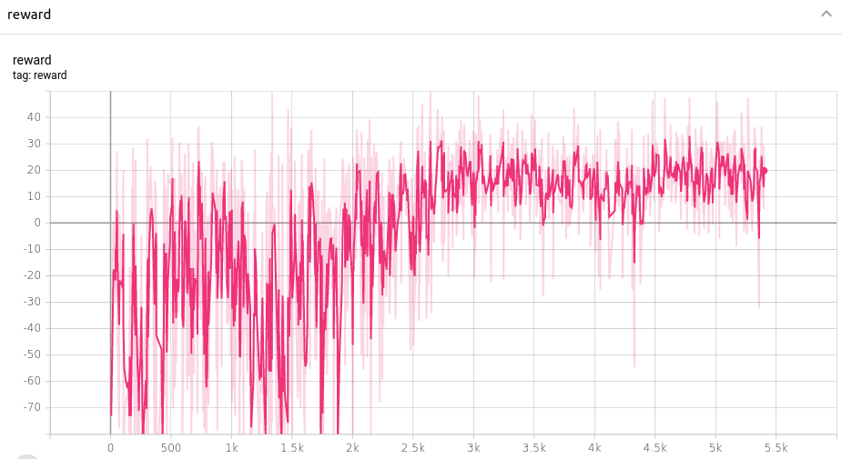

# Quelques agents

## hys20.h5

hysterésis permanent autour d'une température de consigne de 20°C

## 2021_09_23_07_42_32_hys20_retrained_k0dot9_hys20

agent entrainé à gérer des alternances de périodes d'occupation et de non-occupation sur l'environnement bloch

## Heat_aimlDDQN_240520222037_cells_k=0dot9_GAMMA=0dot97_Vote_final_reward_only

agent entrainé à gérer seulement les périodes de non-occupation du bâtiment sur l'environnement cells




graphiques produits avec tensorboard

pour utiliser tensorboard :

```
tensorboard --logdir=TensorBoard
```
